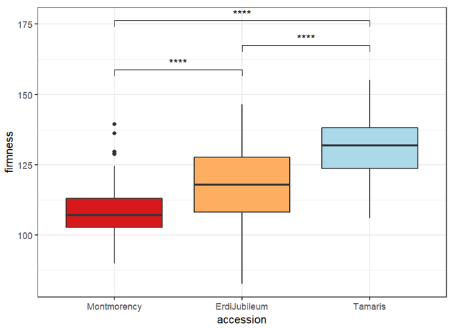
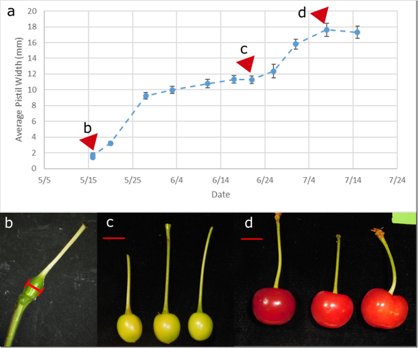

# NAPB2022-methods
## Subgenome expression of a fruit softening-associated expansin varies among cultivars of the tetraploid sour cherry (*Prunus cerasus* L.)

Kathleen E. B. Rhoades, Charity Goeckeritz, Courtney Hollender, Amy Iezzoni

Dept. of Horticulture, Michigan State University

#### Abstract

Sour cherry (Prunus cerasus L.) is a highly heterozygous allotetraploid tree whose characteristic acidic fruit is processed for use in pies, jams, and juices. Sour cherry came about from the interspecific cross of the diploid sweet cherry (P. avium L.) and the wild tetraploid ground cherry (P. fruticosa Pall.). Evidence supports repeated progenitor introgressions into sour cherry followed by human selection. A previously identified expansin associated with fruit softening (EXP2) in the sour cherry cultivar Montmorency(1) provided a valuable opportunity to investigate the subgenome origin, structural variation, and possible expression bias in a panel of sour cherry cultivars that exhibit a range of fruit firmness. Our results confirm that EXP2 increases over the course of fruit development and is most highly expressed during fruit softening in multiple accessions of sweet cherry and sour cherry and one ground cherry accession. In sour cherry, we also show that all homoeologs of EXP2 do not express at the same levels, and our findings suggest that structural variation is contributing to differential expression of EXP2 from the P. fruiticosa subgenome in the sour cherry Erdi Jubileum. This work provides a template for further investigations of candidate genes in sour cherry.

(1)Yoo, S.D., Gao, Z., Cantini, C., Loescher, W.H. and Van Nocker, S., 2003. Fruit ripening in sour cherry: Changes in expression of genes encoding expansins and other cell-wall-modifying enzymes. Journal of the American Society for Horticultural Science, 128(1), pp.16-22.]

### Full Materials and Methods

#### Plant Material

Three accessions of tetraploid sour cherry:

  * Montmorency (most common cultivar in the US)
  * Erdi Jubileum (Hungarian cultivar)
  * Tamaris (Russian cultivar)
  
#### Phenotyping

All fruit were picked at harvest ripeness and firmness was measured in grams per mm of compression using a Firmtech 2 [http://www.bio-works.us/](http://www.bio-works.us/). At least two and up to four years of firmness data were used to create Fig. 2.  

###### Figure 2: fruit firmness distributions for Montmorency, Erdi Jubileum, and Tamaris

#### Fruit sampling for RNA

###### Figure 3: Fruit growth and collection for RNAseq

Fruit was collected from immediately post-bloom to fruit maturity and the widest width of the fruit was measured at each collection point. Samples were selected for RNAseq based on their location in the fruit growth curve for each genotype so as to standardize developmental stage between genotypes with different bloom and maturity dates (Fig. 3a). The timepoints selected for RNA sequencing were the beginning of stage 1, when exponential growth and cell division are occurring (Fig. 3b, red line indicates fruit width of 1.696 mm), the end of growth stage 2, around the conclusion of pit hardening and just before the second exponential growth phase (Fig. 3c, scale bar = 1 cm), and the end of growth stage 3, immediately after the second exponential growth phase (Fig. 3d, scale bar = 1 cm). 

Young leaves were collected for DNA extraction. DNA was extracted with the [Qiagen Plant DNEasy Kit according to manufacturer's instructions](https://www.qiagen.com/us/products/discovery-and-translational-research/dna-rna-purification/dna-purification/genomic-dna/dneasy-plant-pro-and-plant-kits/?catno=69104). 

#### Sequencing and Analysis

An Illumina TruSeq gDNA library was prepared according to the manufacturer's instructions and sequenced on a HiSeq4000 at the Research and Technology Facility (RTSF) of Michigan State University (MSU). Illumina short-read DNA sequencing (2x150bp) was performed on all accessions to a depth of ~50x. 3 biological replicates of each fruit growth stage for each accession underwent Illumina TruSeq Stranded mRNA library preparation according to the manufacturer's instructions at MSU RTSF, and Illumina RNA sequencing (2x150bp) with a target of ~30 million reads per library. Reads were checked for quality using [FastQC v0.11.5](https://www.bioinformatics.babraham.ac.uk/projects/fastqc/) and trimmed with [Trimmomatic v0.36](http://www.usadellab.org/cms/?page=trimmomatic). DNA reads were aligned to the respective species’ reference genome (Goeckeritz et al., in prep; Wang et al., 2020) using BWA/0.7.17. RNA reads were aligned to the respective species’ reference genome and transcript abundance was counted using [kallisto v0.44.0](https://pachterlab.github.io/kallisto/about). Differential gene expression was evaluated using the [DESeq2 package in R](https://bioconductor.org/packages/release/bioc/html/DESeq2.html). 

Heatmaps were generated using the R package [pheatmap](https://www.rdocumentation.org/packages/pheatmap/versions/1.0.12/topics/pheatmap). RNA and DNA alignments were visualized using [IGV/2.12.3](https://software.broadinstitute.org/software/igv/). 

### Full references

Bolger, A. M., Lohse, M., & Usadel, B. (2014). Trimmomatic: A flexible trimmer for Illumina Sequence Data. Bioinformatics, btu170.

Bray, N.L., Pimentel, H., Melsted, P. and Pachter, L., 2016. Near-optimal probabilistic RNA-seq quantification. Nature biotechnology, 34(5), pp.525-527.

Cai, L. et al. (2019) ‘A fruit firmness QTL identified on linkage group 4 in sweet cherry (Prunus avium L.) is associated with domesticated and bred germplasm’, Scientific Reports, 9(1), p. 5008. Available at: https://doi.org/10.1038/s41598-019-41484-8.

Gasic, K., Hernandez, A. and Korban, S.S. (2004) ‘RNA extraction from different apple tissues rich in polyphenols and polysaccharides for cDNA library construction’, Plant Molecular Biology Reporter, 22(4). Available at: https://doi.org/10.1007/BF02772687.

Love MI, Huber W, Anders S (2014). “Moderated estimation of fold change and dispersion for RNA-seq data with DESeq2.” Genome Biology, 15, 550. doi: 10.1186/s13059-014-0550-8. 

Macková, L., Vít, P. and Urfus, T. (2018) ‘Crop-to-wild hybridization in cherries-Empirical evidence from Prunus fruticosa’, Evolutionary Applications, 11(9), pp. 1748–1759. Available at: https://doi.org/10.1111/eva.12677.
Wang, J. et al. (2020) ‘Chromosome-scale genome assembly of sweet cherry ( Prunus avium L.) cv. Tieton obtained using long-read and Hi-C sequencing’, Horticulture Research, 7(1), pp. 1–11. Available at: https://doi.org/10.1038/s41438-020-00343-8.

Robinson, J.T., Thorvaldsdóttir, H., Wenger, A.M., Zehir, A. and Mesirov, J.P., 2017. Variant review with the integrative genomics viewer. Cancer research, 77(21), pp.e31-e34.

Wang, J. et al. (2020) ‘Chromosome-scale genome assembly of sweet cherry ( Prunus avium L.) cv. Tieton obtained using long-read and Hi-C sequencing’, Horticulture Research, 7(1), pp. 1–11. Available at: https://doi.org/10.1038/s41438-020-00343-8.

Yoo, S.D. et al. (2003) ‘Fruit ripening in sour cherry: Changes in expression of genes encoding expansins and other cell-wall-modifying enzymes’, Journal of the American Society for Horticultural Science, 128(1), pp. 16–22.

### Author contact info:

[Kathleen E. B. Rhoades](mailto:rhoade24@msu.edu),
[Charity Goeckeritz](mailto:goeckeri@msu.edu),
[Courtney Hollender](mailto:chollend@msu.edu),
[Amy Iezzoni](mailto:iezzoni@msu.edu)
